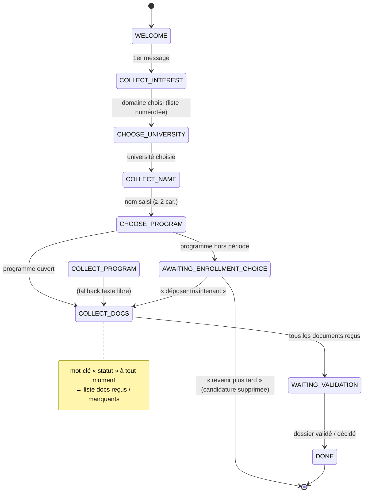
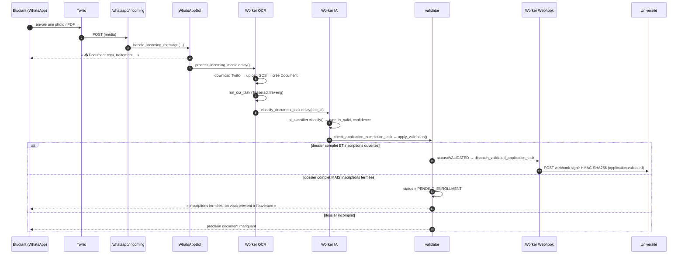
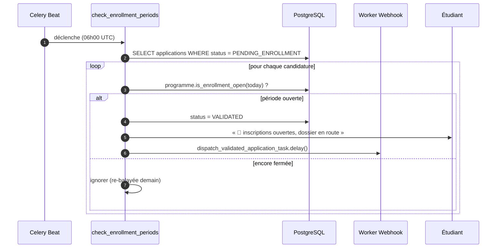
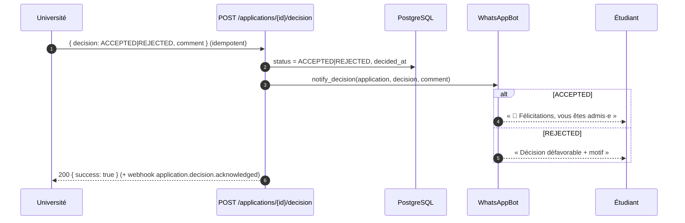

# Architecture & cahier des charges — v2

> Diagrammes de séquence et spécification de la version 2 (programmes,
> formulaires dynamiques, périodes d'inscription). Reflète le code **réellement
> implémenté** au 2026-06-07, pas une cible théorique.
>
> Complète `CLAUDE.md` (source de vérité produit) et `docs/STUBS_DEV1.md`
> (état migrations / infra).

---

## 1. Ce qui change en v2 (delta v1 → v2)

| Domaine | v1 | v2 |
|---------|----|----|
| Choix programme | texte libre (`COLLECT_PROGRAM`) | orientation par **domaine d'intérêt** → liste d'**universités** filtrées → liste de **programmes** (`programs`) ; le texte libre reste en fallback |
| Formulaire | champs fixes (nom, programme) | **formulaire dynamique** par programme (`admission_forms` / `form_fields`) |
| Documents requis | liste codée en dur | configurables par formulaire (`required_documents`), fallback liste ordonnée codée |
| Inscriptions | toujours ouvertes | **périodes d'inscription** par programme (`enrollment_start` / `enrollment_end`) + statut `PENDING_ENROLLMENT` + tâche Beat quotidienne |
| Statuts candidature | `COLLECTING … REJECTED` | + `CHOOSING_UNIVERSITY`, `CHOOSING_PROGRAM`, `COLLECTING_FIELDS`, `COLLECTING_DOCUMENTS`, `PENDING_ENROLLMENT` |
| Classification IA | Anthropic Claude | Anthropic **ou** Google Gemini (`AI_PROVIDER`, défaut `anthropic`) |
| Données | — | import des universités **Boussole.in** (`scripts/import_boussole.py`) |

---

## 2. Machine à états de la conversation WhatsApp (bot v2)

États : `app/services/whatsapp_bot.py::ConversationState`.

---

## 3. Pipeline de validation d'un document (OCR → IA → validation)

Déclenché à chaque média reçu. Chaque worker enchaîne le suivant.

---

## 4. Périodes d'inscription (tâche planifiée)

`check_enrollment_periods_task` — Celery Beat, tous les jours à 06h00 UTC
(`app/workers/celery_app.py::beat_schedule`).

---

## 5. Boucle de décision (université → étudiant)

---

## 6. Cahier des charges technique v2 — points de conformité

- **Découverte guidée** : le bot oriente par domaine puis propose des **listes
  numérotées** (universités, programmes) — pas de saisie libre quand des
  `programs` sont configurés (fallback `COLLECT_PROGRAM` sinon).
- **Formulaires dynamiques** : un `AdmissionForm` publié par programme définit ses
  `FormField` (validés par `validation_regex`) et ses `RequiredDocument`.
- **Périodes d'inscription** : `Program.is_enrollment_open()` arbitre dispatch
  immédiat vs `PENDING_ENROLLMENT` ; la tâche Beat ré-ouvre automatiquement.
- **Multi-provider IA** : `AI_PROVIDER` bascule Anthropic ↔ Gemini sans changer le
  contrat `DocumentClassificationResult`.
- **Idempotence webhooks** : `idempotency_key` unique, signature HMAC-SHA256,
  retries 1m/5m/15m/1h/6h.
- **Migrations** : `0001` (socle) + `0002` (tout le v2, enrollment inclus). Voir
  `docs/STUBS_DEV1.md`.

### Reste à faire (hors périmètre code v2)
- [ ] `external_id` (universities/programs) pour ré-imports Boussole idempotents.
- [ ] Seed de programmes réels (domaines + dates) par université cliente.
